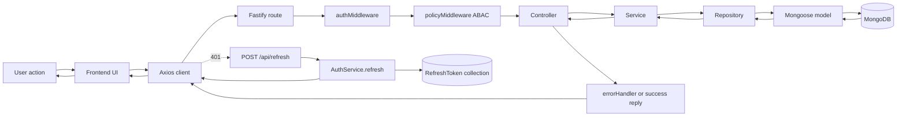

# LMS Backend (Fastify + MongoDB + JWT + ABAC)

## 1. Tech Stack
1. Node.js + Fastify
2. MongoDB + Mongoose
3. JWT access token + refresh token
4. Phan tang theo huong route -> controller -> service -> repository -> model

## 2. Project Structure

```text
src/
  config/
  controllers/
  errors/
  middleware/
  models/
  policies/
  repositories/
  routes/
  services/
  utils/
  app.js
  container.js
  server.js
```

## 3. Run Project
1. Tao file `.env` (hoac copy tu `.env.example` neu co).
2. Dien `MONGODB_URI`, `JWT_ACCESS_SECRET`, `JWT_REFRESH_SECRET`.
3. Cai dependency va chay server.

```bash
npm install
npm run dev
```

## 4. API Surface

### Auth
1. `POST /api/register`
2. `POST /api/login`
3. `POST /api/refresh`

### Courses
1. `POST /api/courses`
2. `GET /api/courses`
3. `GET /api/courses/:courseId`
4. `PATCH /api/courses/:courseId`
5. `DELETE /api/courses/:courseId`

### Lessons
1. `POST /api/lessons`
2. `GET /api/lessons`
3. `GET /api/lessons/:lessonId`
4. `PATCH /api/lessons/:lessonId`
5. `DELETE /api/lessons/:lessonId`

### Enrollments
1. `POST /api/enrollments/enroll`
2. `GET /api/enrollments`

## 5. Workflow Tong The He Thong (End-to-End)

### 5.1 Startup
1. `src/server.js` goi `buildApp()` tu `src/app.js`.
2. `src/app.js` tao Fastify app, tao dependency container (`src/container.js`), gan global error handler.
3. `src/server.js` connect MongoDB qua `src/config/db.js`.
4. Neu connect thanh cong, server listen tren `PORT`.

### 5.2 Request Lifecycle
1. Request vao endpoint `/api/...`.
2. Route layer xac dinh endpoint nao xu ly.
3. Neu la private route, request phai qua `authMiddleware`.
4. Sau do qua `policyMiddleware` de check ABAC.
5. Neu duoc phep, controller goi service.
6. Service xu ly business rule va goi repository.
7. Repository query model Mongoose.
8. MongoDB tra du lieu nguoc lai qua repository -> service -> controller.
9. Controller tra response JSON cho client.
10. Neu co loi, `errorHandler` chuan hoa ma loi va body loi.

## 6. Debug Runtime Step-by-Step

### 6.1 Login (POST /api/login)
1. Frontend gui body `email/password` den `/api/login`.
2. Route `authRoutes` map vao `AuthController.login`.
3. Controller goi `AuthService.login`.
4. Service tim user theo email.
5. Service so sanh password hash.
6. Neu dung, service tao `accessToken` va `refreshToken`.
7. Service hash refresh token va luu vao collection `RefreshToken`.
8. Controller tra response gom `accessToken`, `refreshToken`, `user`.
9. Frontend luu token, gan Bearer token cho request tiep theo.

### 6.2 CRUD Course (private API)
1. Frontend gui request den `/api/courses` voi Bearer token.
2. `authMiddleware` verify JWT va gan `request.user`.
3. `policyMiddleware` goi `policyEngine.can(...)` de check hanh dong (`create/read/update/delete`).
4. Neu pass policy, vao `CourseController`.
5. Controller goi `CourseService`.
6. Service goi `CourseRepository`.
7. Repository build query co data scope theo role roi query MongoDB.
8. Ket qua tra nguoc ve controller.
9. Controller tra HTTP status phu hop.
10. Neu khong duoc quyen, middleware/service nem loi 403 va errorHandler tra response loi.

### 6.3 Enroll (POST /api/enrollments/enroll)
1. Request vao route enroll.
2. Auth middleware check token.
3. Policy middleware check ABAC cho enrollment create.
4. Controller goi `EnrollmentService.enroll`.
5. Service check rule bo sung:
6. Teacher chi enroll tren khoa hoc thuoc minh.
7. Student chi duoc enroll chinh minh.
8. Service check trung enrollment (`findOneByUserAndCourse`).
9. Neu hop le, repository tao enrollment moi.
10. Response 201 tra enrollment vua tao.

## 7. Data Flow (Frontend -> Backend -> Database -> Frontend)



## 8. Vai Tro Tung Phan

### Route
1. Dinh nghia endpoint va HTTP method.
2. Gan middleware theo endpoint.
3. Chuyen request den dung controller.

### Controller
1. Nhan request HTTP.
2. Goi service.
3. Chot ma status va response body.

### Service
1. Chua business logic chinh.
2. Kiem tra quy tac nghiep vu.
3. Nem AppError voi status phu hop khi vi pham rule.

### Model
1. Dinh nghia schema database.
2. Dinh nghia index, unique constraint.
3. La contract du lieu giua app va MongoDB.

### Repository
1. Bao dong query Mongoose.
2. Enforce data scope o tang truy van.
3. Giu cho service khong phu thuoc chi tiet query.

### Middleware
1. Auth middleware xu ly xac thuc token.
2. Policy middleware xu ly phan quyen ABAC.
3. Error handler xu ly va chuan hoa tat ca loi.

## 9. Tai Sao Thiet Ke Nhu Vay
1. Tach controller va service de tung tang co mot trach nhiem ro rang.
2. Dung middleware de dung cac concern cross-cutting o mot cho thay vi lap lai.
3. Dung repository de tach business logic khoi persistence logic.
4. Dung ABAC + data scope de vua check hanh dong vua check pham vi du lieu.
5. Cau truc nay de test, debug, va mo rong tinh nang de hon khi team lon len.

## 10. Danh Gia Kien Truc

### Diem tot
1. Co phan tang ro rang, de doc luong chay.
2. Co refresh token rotation va hash refresh token trong DB.
3. Co ABAC policy engine tach rieng khoi service.
4. Co data scope trong repository de han che lo du lieu.
5. Co AppError + errorHandler de thong nhat format loi.

### Diem chua toi uu
1. Mot so rule ABAC cho role teacher phu thuoc `resource`, trong khi list endpoint khong co `resource`, co the gay false deny.
2. Chua thay schema validation request chuan cua Fastify o route level.
3. Mot so truy van o lesson co nguy co tieu ton query khi du lieu lon.
4. Frontend can dam bao khong fallback token demo o production.

### Cach cai thien
1. Dieu chinh policy list cho teacher (khong bat buoc `resource` voi read list, hoac truyen scope context phu hop).
2. Bo sung schema validation cho body, params, query.
3. Toi uu truy van lesson bang aggregate hoac giam so query trung gian.
4. Bo sung integration test theo role cho cac route quan trong.

## 11. ABAC + Data Scope (Tom Tat)

### ABAC policy checks (request-time)
1. Vi tri: `policies/policyEngine.js` va cac file `policies/*.js`.
2. Subject attrs: `id`, `role`, `department`.
3. Resource attrs: `createdBy`, `courseCreatedBy`, `userId`, `courseId`.
4. Action: `create`, `read`, `update`, `delete`.

### Data scope checks (query-time)
1. Vi tri: `utils/dataScope.js`.
2. Enforce trong repository layer.
3. Admin: khong filter.
4. Teacher: chi du lieu do minh tao.
5. Student: chi du lieu thuoc cac khoa hoc da enroll.

## 12. Example Payloads

### Register
```json
{
  "name": "Alice",
  "email": "alice@example.com",
  "password": "StrongPass123",
  "role": "teacher",
  "department": "Computer Science"
}
```

### Login
```json
{
  "email": "alice@example.com",
  "password": "StrongPass123"
}
```

### Refresh
```json
{
  "refreshToken": "<jwt-refresh-token>"
}
```
